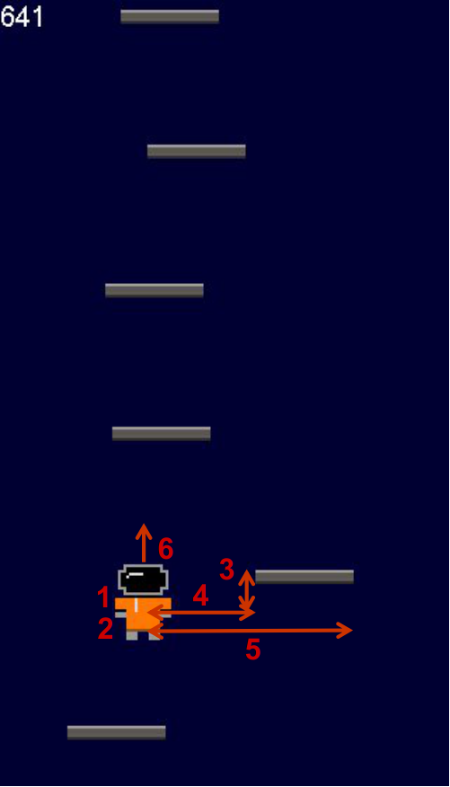

# Wow, that's NEAT!

Using the NEAT algorithm so solve a Doodle Jump-styled game

After training for 24 epochs            |
:-------------------------:|
  | 

The NEAT (NeuralEvolution of Augmented Topologies) is an algorithm that 
combines neural nets with genetic algorithms. A very comprehensive overview
of this algorithm can be found here: http://nn.cs.utexas.edu/downloads/papers/stanley.ec02.pdf

## Implementation

To solve this task I basically just used the incredible good library
neat-python (https://github.com/CodeReclaimers/neat-python)

To use this library it is neccessary to define states that will be fed
into neural net every so often. I use 6 values to represent the current 
state of the game:

State of the game            |
:-------------------------:|
  | 
 

1. x-position of the player
2. y-position of the player
3. y difference between player and closest bar
4. x difference between player and left side of the closest bar
5. x difference between player and right side of the closest bar
6. y velocity of the player
